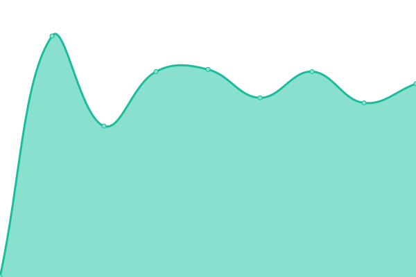
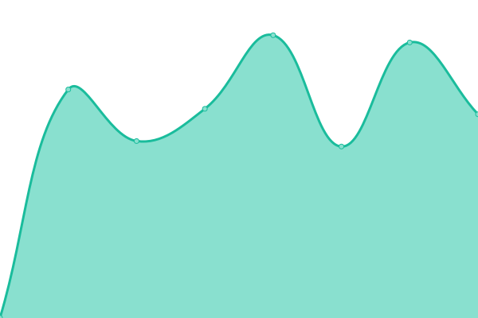
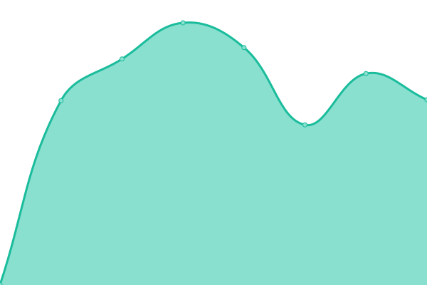
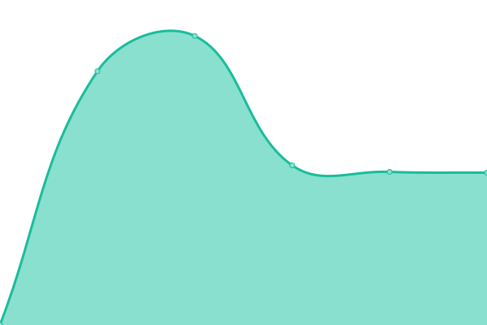
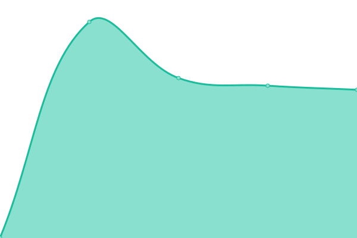

# [📈 Live Status](https://Gonchito.github.io/VerifStatusPages): <!--live status--> **🟧 Partial outage**

This repository contains the open-source uptime monitor and status page for [Gonzalo Barreiro](https://Gonchito.github.io/VerifStatusPages), powered by [Upptime](https://github.com/upptime/upptime).

With [Upptime](https://upptime.js.org), you can get your own unlimited and free uptime monitor and status page, powered entirely by a GitHub repository. We use [Issues](https://github.com/Gonchito/VerifStatusPages/issues) as incident reports, [Actions](https://github.com/Gonchito/VerifStatusPages/actions) as uptime monitors, and [Pages](https://Gonchito.github.io/VerifStatusPages) for the status page.

<!--start: status pages-->
<!-- This summary is generated by Upptime (https://github.com/upptime/upptime) -->
<!-- Do not edit this manually, your changes will be overwritten -->
<!-- prettier-ignore -->
| URL | Status | History | Response Time | Uptime |
| --- | ------ | ------- | ------------- | ------ |
|  [Google](www.google.com) | 🟩 Up | [google.yml](https://github.com/Gonchito/VerifStatusPages/commits/HEAD/history/google.yml) | 

 78ms
     
 | 

<a href="https://Gonchito.github.io/VerifStatusPages/history/google">100.00%</a>
    

|  [Administracion prod](https://administracion.rdigitales.com.ar/login.aspx) | 🟩 Up | [administracion-prod.yml](https://github.com/Gonchito/VerifStatusPages/commits/HEAD/history/administracion-prod.yml) | 

 1020ms
     
 | 

<a href="https://Gonchito.github.io/VerifStatusPages/history/administracion-prod">100.00%</a>
    

|  [Administracion test](https://administracion.rdtest.com.ar:4433//login.aspx) | 🟩 Up | [administracion-test.yml](https://github.com/Gonchito/VerifStatusPages/commits/HEAD/history/administracion-test.yml) | 

 975ms
     
 | 

<a href="https://Gonchito.github.io/VerifStatusPages/history/administracion-test">100.00%</a>
    

|  [Cc prod](https://ccweb.rdigitales.com.ar/Index.aspx) | 🟩 Up | [cc-prod.yml](https://github.com/Gonchito/VerifStatusPages/commits/HEAD/history/cc-prod.yml) | 

 1036ms
     
 | 

<a href="https://Gonchito.github.io/VerifStatusPages/history/cc-prod">100.00%</a>
    

|  [Cc test](https://ccweb.rdtest.com.ar:4433/Index.aspx) | 🟩 Up | [cc-test.yml](https://github.com/Gonchito/VerifStatusPages/commits/HEAD/history/cc-test.yml) | 

 1399ms
     
 | 

<a href="https://Gonchito.github.io/VerifStatusPages/history/cc-test">100.00%</a>
    

|  [galeno prod](https://galeno.rdigitales.com.ar) | 🟥 Down | [galeno-prod.yml](https://github.com/Gonchito/VerifStatusPages/commits/HEAD/history/galeno-prod.yml) | 

 975ms
     
 | 

<a href="https://Gonchito.github.io/VerifStatusPages/history/galeno-prod">0.00%</a>
    

|  [galeno test](https://galeno.rdtest.com.ar:4433) | 🟥 Down | [galeno-test.yml](https://github.com/Gonchito/VerifStatusPages/commits/HEAD/history/galeno-test.yml) | 

 881ms
     
 | 

<a href="https://Gonchito.github.io/VerifStatusPages/history/galeno-test">0.00%</a>
    

|  [qbe prod](https://qbe.rdigitales.com.ar) | 🟩 Up | [qbe-prod.yml](https://github.com/Gonchito/VerifStatusPages/commits/HEAD/history/qbe-prod.yml) | 

 881ms
     
 | 

<a href="https://Gonchito.github.io/VerifStatusPages/history/qbe-prod">100.00%</a>
    

|  [qbe test](https://qbe.rdtest.com.ar:4433) | 🟩 Up | [qbe-test.yml](https://github.com/Gonchito/VerifStatusPages/commits/HEAD/history/qbe-test.yml) | 

 1005ms
     
 | 

<a href="https://Gonchito.github.io/VerifStatusPages/history/qbe-test">100.00%</a>
    

|  [Rd+ prod](https://rdplus.rdigitales.com.ar/v2/loggin.aspx) | 🟩 Up | [rd-prod.yml](https://github.com/Gonchito/VerifStatusPages/commits/HEAD/history/rd-prod.yml) | 

 960ms
     
 | 

<a href="https://Gonchito.github.io/VerifStatusPages/history/rd-prod">100.00%</a>
    

|  [Rd+ test](https://rdplus.rdtest.com.ar:4433/v2/loggin.aspx) | 🟩 Up | [rd-test.yml](https://github.com/Gonchito/VerifStatusPages/commits/HEAD/history/rd-test.yml) | 

 1024ms
     
 | 

<a href="https://Gonchito.github.io/VerifStatusPages/history/rd-test">100.00%</a>
    

|  [sincromobile prod](https://sincromobile.rdigitales.com.ar) | 🟥 Down | [sincromobile-prod.yml](https://github.com/Gonchito/VerifStatusPages/commits/HEAD/history/sincromobile-prod.yml) | 

 1098ms
     
 | 

<a href="https://Gonchito.github.io/VerifStatusPages/history/sincromobile-prod">0.00%</a>
    

|  [sincromobile test](https://sincromobile.rdtest.com.ar:4433) | 🟥 Down | [sincromobile-test.yml](https://github.com/Gonchito/VerifStatusPages/commits/HEAD/history/sincromobile-test.yml) | 

 1101ms
     
 | 

<a href="https://Gonchito.github.io/VerifStatusPages/history/sincromobile-test">0.00%</a>
    

|  [sura prod](https://sura.rdigitales.com.ar) | 🟥 Down | [sura-prod.yml](https://github.com/Gonchito/VerifStatusPages/commits/HEAD/history/sura-prod.yml) | 

 880ms
     
 | 

<a href="https://Gonchito.github.io/VerifStatusPages/history/sura-prod">0.00%</a>
    

|  [sura test](https://sura.rdtest.com.ar:4433) | 🟥 Down | [sura-test.yml](https://github.com/Gonchito/VerifStatusPages/commits/HEAD/history/sura-test.yml) | 

 923ms
     
 | 

<a href="https://Gonchito.github.io/VerifStatusPages/history/sura-test">0.00%</a>
    

|  [ws prod](https://ws.rdigitales.com.ar) | 🟥 Down | [ws-prod.yml](https://github.com/Gonchito/VerifStatusPages/commits/HEAD/history/ws-prod.yml) | 

 938ms
     
 | 

<a href="https://Gonchito.github.io/VerifStatusPages/history/ws-prod">0.00%</a>
    

|  [ws test](https://ws.rdtest.com.ar:4433) | 🟥 Down | [ws-test.yml](https://github.com/Gonchito/VerifStatusPages/commits/HEAD/history/ws-test.yml) | 

 930ms
     
 | 

<a href="https://Gonchito.github.io/VerifStatusPages/history/ws-test">0.00%</a>
    

|  [wsbackoffice prod](https://wsbackoffice.rdigitales.com.ar) | 🟥 Down | [wsbackoffice-prod.yml](https://github.com/Gonchito/VerifStatusPages/commits/HEAD/history/wsbackoffice-prod.yml) | 

 965ms
     
 | 

<a href="https://Gonchito.github.io/VerifStatusPages/history/wsbackoffice-prod">0.00%</a>
    

|  [wsbackoffice test](https://wsbackoffice.rdtest.com.ar:4433) | 🟥 Down | [wsbackoffice-test.yml](https://github.com/Gonchito/VerifStatusPages/commits/HEAD/history/wsbackoffice-test.yml) | 

 854ms
     
 | 

<a href="https://Gonchito.github.io/VerifStatusPages/history/wsbackoffice-test">0.00%</a>
    

|  [wsrsa prod](https://wsrsa.rdigitales.com.ar) | 🟥 Down | [wsrsa-prod.yml](https://github.com/Gonchito/VerifStatusPages/commits/HEAD/history/wsrsa-prod.yml) | 

 978ms
     
 | 

<a href="https://Gonchito.github.io/VerifStatusPages/history/wsrsa-prod">0.00%</a>
    

|  [wsrsa test](https://wsrsa.rdtest.com.ar:4433) | 🟥 Down | [wsrsa-test.yml](https://github.com/Gonchito/VerifStatusPages/commits/HEAD/history/wsrsa-test.yml) | 

 872ms
     
 | 

<a href="https://Gonchito.github.io/VerifStatusPages/history/wsrsa-test">0.00%</a>
    

|  [Institucional prod](https://www.rdigitales.com.ar) | 🟩 Up | [institucional-prod.yml](https://github.com/Gonchito/VerifStatusPages/commits/HEAD/history/institucional-prod.yml) | 

 3023ms
     
 | 

<a href="https://Gonchito.github.io/VerifStatusPages/history/institucional-prod">100.00%</a>
    

|  [Institucional test](https://www.rdtest.com.ar:4433) | 🟩 Up | [institucional-test.yml](https://github.com/Gonchito/VerifStatusPages/commits/HEAD/history/institucional-test.yml) | 

 1245ms
     
 | 

<a href="https://Gonchito.github.io/VerifStatusPages/history/institucional-test">100.00%</a>
    

|  [photoup test](https://photoup.rdtest.com.ar:4433) | 🟥 Down | [photoup-test.yml](https://github.com/Gonchito/VerifStatusPages/commits/HEAD/history/photoup-test.yml) | 

 1525ms
     
 | 

<a href="https://Gonchito.github.io/VerifStatusPages/history/photoup-test">0.00%</a>
    

|  [wsp test](https://wsp.rdtest.com.ar:4433) | 🟥 Down | [wsp-test.yml](https://github.com/Gonchito/VerifStatusPages/commits/HEAD/history/wsp-test.yml) | 

 1719ms
     
 | 

<a href="https://Gonchito.github.io/VerifStatusPages/history/wsp-test">0.00%</a>
    

<!--end: status pages-->

[**Visit our status website →**](https://Gonchito.github.io/VerifStatusPages)

## 📄 License

- Powered by: [Upptime](https://github.com/upptime/upptime)
- Code: [MIT](./LICENSE) © [Gonzalo Barreiro](https://Gonchito.github.io/VerifStatusPages)
- Data in the `./history` directory: [Open Database License](https://opendatacommons.org/licenses/odbl/1-0/)
